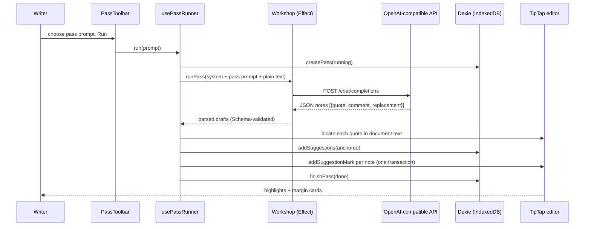
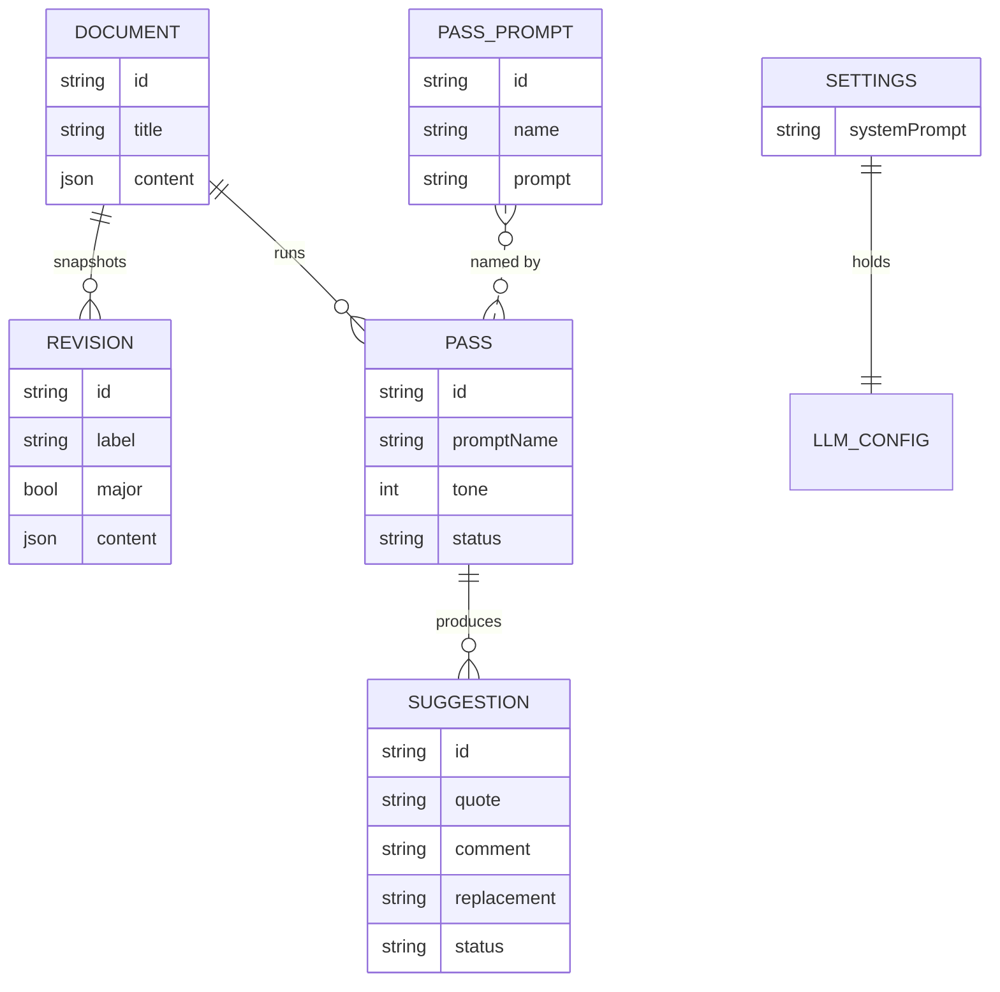

# Writing Workshop

Local-only prose workshop. Write in a Notion-style editor, run LLM editing
passes, and work through the notes one by one in a Genius-style margin.
All data stays in the browser (IndexedDB). The only network traffic is the
chat completion request you trigger, sent to the endpoint you configure.

## Build

```sh
pnpm install
pnpm build        # dist/index.html, fully self-contained
pnpm dev          # local dev server
pnpm check        # typecheck + format check + lint (anti-slop rules)
```

`dist/index.html` inlines all JS, CSS, and fonts. Open it from disk in Chrome
or Firefox (both verified from `file://`). No CDN or external assets are used.

Remote endpoints need CORS enabled for a `file://` origin (`Access-Control-Allow-Origin: *`).
Local servers (Ollama, LM Studio, llama.cpp, vLLM) usually allow this by default.

## How a pass works



The highlight is a ProseMirror mark that carries the suggestion id, so it
moves with the text as the writer edits. The margin card is positioned from
the highlight's rendered position; cards are pushed apart so they never
overlap, and the active card stays pinned to its highlight.

## Data model



## Layout

- `src/domain` pure logic: model types, quote anchoring, margin layout.
- `src/db` Dexie schema and repository functions.
- `src/llm` Effect services: `LlmClient` (HTTP) and `Workshop` (prompt + parse).
- `src/editor` TipTap extensions and editor-side suggestion actions.
- `src/components` React UI. `src/components/ui` is generated by shadcn.
- `tools/oxlint/anti-slop` vendored lint rules (see `UPSTREAM.md`).

## Data safety

- Sidebar → "Back up everything" downloads a JSON file with all documents,
  revisions, passes, notes, prompts, and settings (API key excluded).
- "Restore backup…" merges a backup file by id; importing twice is harmless.
- "Import Markdown…" creates a document from a `.md` file. "Export" in the
  toolbar downloads the current document as Markdown (highlights are dropped).
- The app requests persistent storage so the browser does not evict the data.

## Keyboard

- `/` in the editor: block menu.
- Select text: formatting bubble, link (`⌘K`), plus "Annotate selection" for a manual note.
- `Alt+↓` / `Alt+↑` (or `Alt+J` / `Alt+K`): next / previous note.
- `Alt+Enter`: accept the active note. `Alt+Backspace`: dismiss it.
